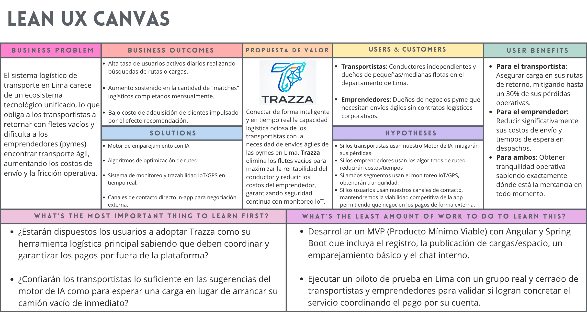

## Capítulo 1
## 1.1. Startup Profile

### 1.1.1. Descripción de la Startup
**NexusLibre** es una startup tecnológica emergente conformada por estudiantes de la carrera de Ingeniería de Software de la Universidad Peruana de Ciencias Aplicadas (UPC). Nos enfocamos en diseñar, desarrollar y desplegar soluciones de software de código abierto (Open Source) escalables, accesibles y orientadas a servicios. Nuestro propósito es resolver problemáticas reales del sector logístico de cadena de suministro mediante productos digitales innovadores y sostenibles. Trabajamos bajo un entorno ágil y colaborativo, aplicando estándares de calidad de la industria para garantizar una comunicación efectiva y el cumplimiento de los objetivos técnicos y de negocio.

### 1.1.2. Perfiles de integrantes del equipo

| Foto                              | Nombres y Apellidos   | Código   | Carrera   | Conocimientos y Habilidades                                                                                                    |
| :-------------------------------: | :-------------------- | :------- | :-------- | :----------------------------------------------------------------------------------------------------------------------------- |
|  | Emanuel Renato Checalla Apaza | [Código] | [Carrera] | [Redactar párrafo resumen indicando principales conocimientos técnicos y habilidades que puede aportar en el equipo]           |
|  | Fabricio Jofred Lozano Quispe | [Código] | [Carrera] | [Redactar párrafo resumen indicando principales conocimientos técnicos y habilidades que puede aportar en el equipo]           |
|  | Gabriel Augusto Peñaranda Caldas | U202210836 | Ingeniería de Software | Me apasiona la infraestructura tecnológica, me destaaco en conocimiento de sistemas operativos, Cloud infrastructure y cloud architecture, manejo bien el lenguaje de JS para frontend y backend           |
|  | Maria Jose Pezo Castilla | [Código] | [Carrera] | [Redactar párrafo resumen indicando principales conocimientos técnicos y habilidades que puede aportar en el equipo]           |
|  | Rodrigo Matias Vite Celis | U202414356 | Ingeniería de Software | Me apasiona la infraestructura cloud y los sistemas operativos. Destaco en arquitectura en la nube y cuento con buen dominio de Javascript tanto para frontend como para backend, python y c++.          |

## 1.2. Solution Profile

### 1.2.1. Antecedentes y problemática

**Técnica 5W2H**

Para comprender la raíz y el impacto de la problemática de los fletes vacíos en el sector logístico, aplicamos la técnica de las 5 'W's y 2 'H's:

* **Who (Quién):** El problema lo padecen de forma directa los transportistas independientes que llevan carga y los empresarios dueños de flotas de camiones, conformando ambos nuestros principales segmentos objetivo.

* **What (Qué):** Los vehículos de transporte de carga se ven obligados a realizar sus viajes de retorno completamente vacíos tras finalizar una entrega.

* **Where (Dónde):** El alcance geográfico de esta problemática se experimenta a nivel del departamento de Lima.

* **When (Cuándo):** Ocurre sistemáticamente en la actualidad, justo en el momento en que inicia el trayecto de regreso, generando en el conductor la frustración de estar realizando un viaje improductivo.

* **Why (Por qué):** Surge por la alta complejidad logística que implica coordinar a un vendedor cerca del punto de entrega inicial con un comprador cercano al destino final, agravado por la ausencia de una red de contactos sólida.

* **How (Cómo se soluciona hoy):** En la actualidad, los afectados intentan mitigar la situación buscando contactos de manera rudimentaria fuera de marcos tecnológicos; sin embargo, en la gran mayoría de los casos, el problema simplemente se ignora y se asume la pérdida.

* **How Much (Cuánto):** A pesar de existir un ligero ahorro de combustible al viajar sin carga, la ineficiencia representa una pérdida aproximada del 30% de rentabilidad. Además, este modelo genera un incremento innecesario en la huella de carbono y encarece significativamente los precios finales de los productos en el mercado.

**Descripción de los antecedentes**

**Enunciado del Problema**

Los transportistas y empresarios de flotas en el departamento de Lima enfrentan una pérdida de hasta el 30% en su rentabilidad y generan una excesiva huella de carbono debido a la alta complejidad logística y la falta de herramientas tecnológicas para conectar con redes de contactos confiables que les permitan aprovechar sus viajes de retorno (fletes vacíos).

**Descripción de la problemática**

**Puntos Clave a Resolver**

* **Reducción de la fricción logística:** Automatizar el emparejamiento entre transportistas con capacidad disponible y usuarios (vendedores/compradores) que necesitan enviar carga.

* **Digitalización de la red de contactos:** Trasladar la búsqueda rudimentaria de oportunidades a un ecosistema tecnológico centralizado y accesible.

* **Optimización operativa y ambiental:** Maximizar la productividad de cada viaje, mitigando el impacto económico en los precios de los productos y reduciendo la emisión innecesaria de carbono.

**Objetivos**

* Diseñar e implementar una plataforma digital que conecte eficientemente la oferta y demanda de fletes en Lima.

* Trazar rutas precisas en tiempo real para optimizar el recorrido logístico entre los puntos de recojo y entrega.

**Restricciones y Alcance**

* **Gestión de Pagos:** La plataforma no actuará como pasarela de pagos. No se procesarán transacciones económicas entre clientes, transportistas, vendedores o compradores; la negociación financiera se realizará estrictamente por fuera del sistema.

* **Conectividad:** Es un requisito indispensable contar con conexión a internet ininterrumpida para acceder a la red de proveedores y compradores.

* **Geolocalización:** El sistema requiere obligatoriamente tener la ubicación del dispositivo activada para el trazado de rutas y seguimiento en tiempo real.

**Propuesta Tecnológica (Trazza)**

Para hacer frente a esta problemática, NexusLibre presenta **Trazza**, una plataforma logística inteligente estructurada sobre una arquitectura en la nube (AWS). El sistema está desarrollado con un backend robusto en Java (Spring Boot) y un frontend web dinámico en TypeScript (Angular).

El núcleo logístico de Trazza se potencia mediante algoritmos computacionales de optimización (como Backtracking, Dijkstra, TSP y BFS) para evaluar capacidades de peso, trazar rutas eficientes y generar matrices de costos.

Además, el producto integra motores de Inteligencia Artificial avanzada para automatizar el emparejamiento (*matchmaking*) entre compradores y vendedores, analizando variables históricas y de proximidad para asignar la carga ideal al camión adecuado sin esfuerzo manual.

A nivel de escalabilidad, Trazza contempla la integración de ecosistemas IoT (Internet de las Cosas) en las flotas para monitorear el estado físico de la carga en tránsito, sumado a un sistema de seguimiento GPS por hardware que garantiza la trazabilidad continua del vehículo y la mercancía, incluso en trayectos donde la conexión a internet sea intermitente o nula.

### 1.2.2. Lean UX Process

#### 1.2.2.1. Lean UX Problem Statements

El estado actual del sistema logístico de transporte de carga en Lima se ha enfocado principalmente en transportistas independientes y pequeños emprendedores que coordinan despachos de forma manual, padeciendo de alta complejidad logística y retornos con fletes vacíos. Lo que los servicios existentes no abordan es la falta de un ecosistema tecnológico unificado y automatizado que conecte la demanda urgente con la capacidad ociosa de los vehículos en tiempo real. Nuestro producto (Trazza) abordará esta brecha mediante un motor de emparejamiento inteligente basado en IA y algoritmos de ruteo que conecte la oferta y la demanda sin intermediación de pagos. Nuestro enfoque inicial será el sector de transportistas independientes, dueños de flotas y pymes en el departamento de Lima. Sabremos que tenemos éxito cuando veamos una alta tasa de emparejamientos exitosos, la reducción del tiempo para asignar camiones y la recuperación del 30% de rentabilidad operativa en nuestro público objetivo.

#### 1.2.2.2. Lean UX Assumptions

**1. Business Assumptions**
* Creemos que existe una alta viabilidad en el mercado local porque la informalidad logística actual genera pérdidas que los transportistas están desesperados por mitigar.
* Creemos que nuestra posición en el mercado será competitiva al no cobrar comisiones por transacciones, actuando puramente como un facilitador de contacto.
* Creemos que lograremos adquirir a nuestros usuarios mediante alianzas estratégicas con gremios de transporte y marketing digital enfocado en emprendedores.

**2. Business Outcome Assumptions**
* Creemos que el éxito de la empresa se indicará por una alta tasa de usuarios activos diarios (DAU) buscando rutas o cargas.
* Creemos que el éxito se reflejará en un aumento sostenido en la cantidad de "matches" logísticos completados mensualmente a través de la plataforma.
* Creemos que evidenciaremos éxito al lograr un bajo costo de adquisición de clientes (CAC) gracias al efecto red ("boca a boca").

**3. User Assumptions**
* Creemos que nuestros usuarios principales son dueños de flotas y transportistas independientes que buscan maximizar la rentabilidad de cada galón de combustible.
* Creemos que nuestro otro segmento son emprendedores y dueños de negocios pyme que necesitan envíos ágiles y no tienen contratos fijos con empresas grandes de logística.
* Creemos que ambos usuarios operan principalmente desde dispositivos móviles durante su jornada laboral y en entornos de conectividad variable.

**4. User Outcome and Benefit Assumptions**
* Creemos que los transportistas desean lograr asegurar carga para sus rutas de retorno, obteniendo el valor de mitigar hasta un 30% de pérdidas económicas.
* Creemos que los emprendedores desean encontrar transporte confiable rápidamente, obteniendo el valor de reducir sus costos de envío y tiempos de espera.
* Creemos que ambos usuarios desean tener garantías de seguridad, obteniendo la tranquilidad de saber dónde está la mercancía en todo momento.

**5. Feature Assumptions**
* Creemos que necesitamos un **Motor de emparejamiento con IA** para conectar automáticamente la carga disponible con el camión ideal.
* Creemos que necesitamos **Algoritmos de optimización de ruteo (Dijkstra, TSP)** para calcular las distancias y los trayectos más eficientes.
* Creemos que necesitamos un **Sistema de monitoreo IoT/GPS** para garantizar la trazabilidad de la carga en tiempo real.
* Creemos que necesitamos **Canales de contacto directo (Chat/Llamada)** dentro de la app para que los usuarios negocien los pagos de forma externa sin fricción.

#### 1.2.2.3. Lean UX Hypothesis Statements

**Hipótesis 1 (Basada en el Motor de emparejamiento con IA)**
Creemos que lograremos un aumento sostenido en los matches logísticos completados mensualmente si los transportistas independientes y dueños de flotas logran mitigar sus pérdidas económicas en los viajes de retorno con el Motor de emparejamiento con IA.

**Hipótesis 2 (Basada en Algoritmos de optimización de ruteo)**
Creemos que lograremos una alta tasa de usuarios activos diarios (DAU) si los emprendedores pymes logran reducir sus costos de envío y tiempos de espera con los Algoritmos de optimización de ruteo (Dijkstra, TSP).

**Hipótesis 3 (Basada en el Sistema de monitoreo IoT/GPS)**
Creemos que lograremos un bajo costo de adquisición por el efecto recomendación si ambos segmentos de usuarios logran la tranquilidad de saber dónde está su mercancía con el Sistema de monitoreo IoT/GPS.

**Hipótesis 4 (Basada en Canales de contacto directo)**
Creemos que lograremos mantener la viabilidad competitiva sin intermediar transacciones si los usuarios logran negociar los servicios logísticos de forma rápida y segura con los Canales de contacto directo (Chat/Llamada) dentro de la app.
#### 1.2.2.4. Lean UX Canvas

En el siguiente gráfico se consolida el proceso estratégico a través del Lean UX Canvas de Trazza. Este lienzo resume visualmente el problema central, los beneficios esperados para nuestros segmentos objetivo (transportistas y emprendedores), las soluciones propuestas y las hipótesis fundamentales del proyecto.

  
   
  <em>Figura: Lean UX Canvas de Trazza. Elaboración propia.</em>

> [Lean UX Canvas de Trazza desde la plataforma Canva](https://canva.link/41xql8grxyjm2m8).
## 1.3. Segmentos objetivo
