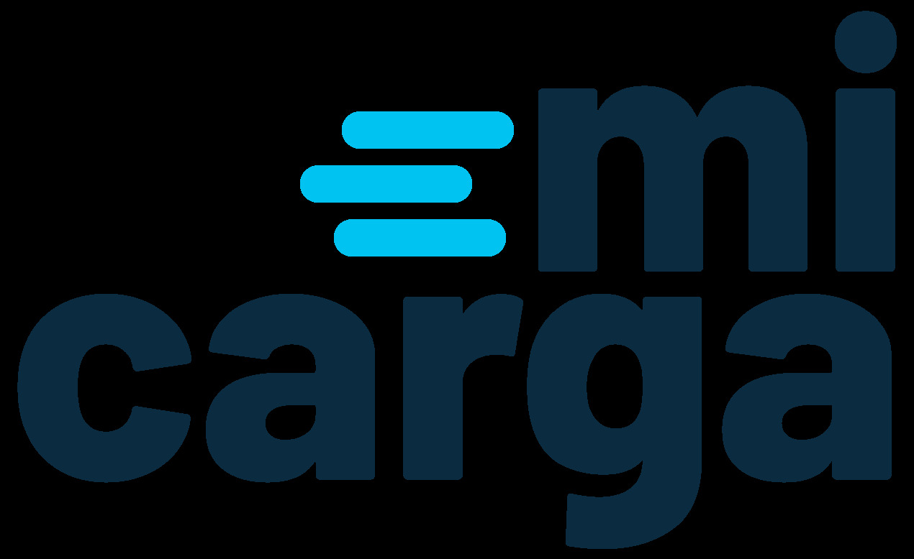
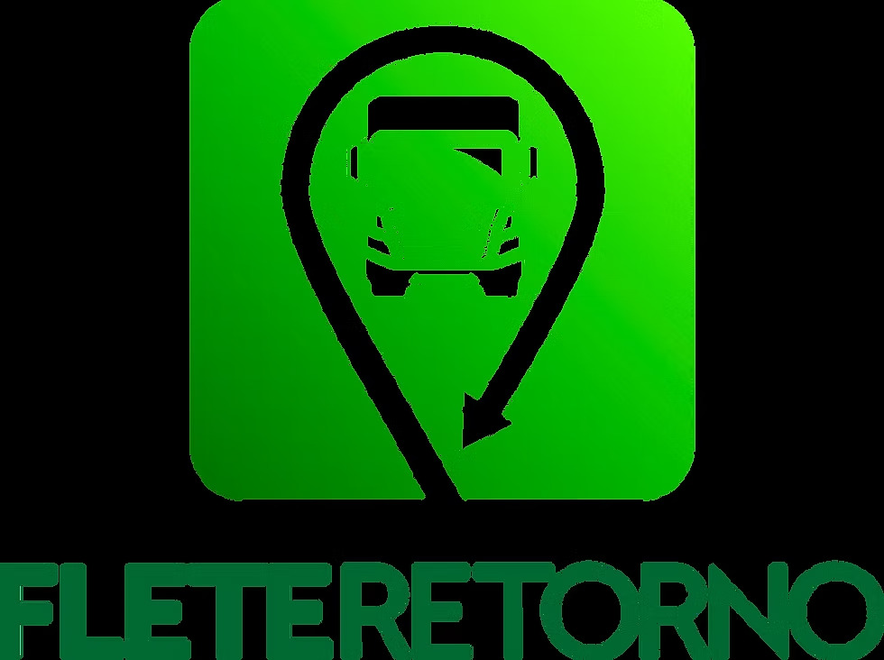

# Capítulo II: Requirements Elicitation & Analysis
## 2.1. Competidores.
### 2.1.1. Análisis competitivo
**Objetivo del análisis:** Comprender cómo se posiciona Trazza frente a las plataformas ya existentes de intermediación de carga y reutilización de fletes vacíos en el Perú y la región, con el fin de identificar oportunidades de diferenciación (motor de emparejamiento con IA, optimización de rutas y monitoreo IoT/GPS) y definir una estrategia de precios y adquisición de usuarios competitiva para el mercado limeño.

Para este análisis se han identificado tres competidores directos: **CargaYa** y **MiCarga**, ambas plataformas peruanas de intermediación de carga, y **FleteRetorno**, plataforma chilena especializada específicamente en la reventa de tramos de retorno vacíos (el mismo problema central que ataca Trazza), y que ya se encuentra en proceso de expansión regional.

**Competitive Analysis Landscape**

| | **Trazza (Propuesta)** | **CargaYa** | **MiCarga** | **FleteRetorno** |
| :--- | :--- | :--- | :--- | :--- |
| **Logo** |  |  |  |  |
| **Overview** | Startup peruana que conecta, mediante un motor de emparejamiento con IA, la capacidad ociosa de transportistas con la necesidad de envíos ágiles de pymes en Lima. | Plataforma peruana que conecta empresarios que publican carga con transportistas verificados por ruta a nivel nacional. | Aplicativo peruano pionero (desarrollado por Tracklink) que conecta usuarios con transportistas disponibles para mudanzas y envío de carga de todo tipo. | Aplicación chilena de "economía circular" enfocada exclusivamente en revender los tramos de retorno vacíos ya contratados por transportistas pyme. |
| **Ventaja competitiva** | Emparejamiento automatizado por IA que reduce el esfuerzo de búsqueda, combinado con optimización de rutas y trazabilidad IoT/GPS sin cobrar comisión por la transacción en sí. | Validación de identidad (DNI/RUC vía RENIEC y SUNAT) y negociación directa sin intermediarios, con 0% de comisión para transportistas. | Monitoreo GPS en tiempo real durante todo el traslado y calificación de transportistas verificados. | Modelo pionero y especializado exclusivamente en tramos de retorno, con enfoque de sostenibilidad (reducción de huella de carbono) como parte de su propuesta de valor. |
| **¿Qué valor ofrece a los clientes?** | Mitigar hasta un 30% de pérdidas operativas al transportista y reducir costos/tiempos de espera al emprendedor, con tranquilidad operativa vía monitoreo continuo. | Encontrar transportistas disponibles por ruta en minutos y negociar la tarifa directamente, sin comisión para quien transporta. | Publicar una carga y recibir cotizaciones de transportistas calificados, pagando dentro de la misma plataforma. | Acceder a fletes más económicos aprovechando camiones que de todas formas regresarán vacíos, con menor huella de carbono. |
| **Perfil de Marketing** | | | | |
| Mercado objetivo | Transportistas independientes/pequeñas flotas y pymes emprendedoras del departamento de Lima. | Transportistas y empresarios generadores de carga en rutas interprovinciales del Perú (Lima–Arequipa, Lima–Trujillo, entre otras). | Personas y empresas que requieren mudanzas o traslado de carga ligera, mediana o pesada a nivel nacional. | Transportistas pyme y empresas generadoras de carga a lo largo de todo Chile (Arica–Puerto Montt), con expansión regional en curso. |
| Estrategias de marketing | Alianzas con gremios de transportistas y marketing digital dirigido a emprendedores pyme, apalancado en el efecto recomendación. | Marketing digital orientado a rutas específicas y testimonios de usuarios ("no tengo que regresar vacío"). | Presencia en tiendas de aplicaciones (Google Play) y relaciones públicas como "primer aplicativo de carga del Perú". | Comunicación centrada en el impacto ambiental (triple impacto) y alianzas con aceleradoras de negocio (UDD Ventures, Corfo). |
| **Perfil de Producto** | | | | |
| Productos & Servicios | Motor de emparejamiento con IA, algoritmos de optimización de ruteo, monitoreo IoT/GPS y canal de contacto in-app para negociación externa. | Publicación de cargas, búsqueda de transportistas por ruta, chat de negociación, noticias sobre el estado de las vías. | Publicación de carga, sistema de cotizaciones de transportistas, monitoreo GPS y calificación de conductores. | Matching de tramos de retorno ya contratados con nuevos clientes que comparten origen–destino. |
| Precios & Costos | Sin comisión por transacción; el pago del servicio se coordina fuera de la plataforma. | Transportistas: 0% de comisión. Empresarios: 3% en la primera carga, luego 5%. | Comisión no publicada; el pago se realiza dentro de la plataforma. | Tarifas "a precio de retorno", inferiores a un flete de ida, sin comisión detallada públicamente. |
| Canales de distribución (Web y/o Móvil) | Web Application (Angular) responsive; landing page estático. | Plataforma web (cargaya.pe). | App móvil (Android) y sitio web (micargapp.pe). | Aplicación móvil y sitio web (fleteretorno.cl). |
| **Análisis SWOT** | | | | |
| Fortalezas | Enfoque doble en IA de emparejamiento y trazabilidad IoT, sin intermediar pagos (menor fricción regulatoria). | Validación de identidad con fuentes oficiales (RENIEC/SUNAT), lo que genera confianza en una comunidad de transportistas informales. | Primer movimiento en el mercado peruano y reconocimiento de marca previo. | Modelo de negocio validado y respaldado por una aceleradora, con más de 1000 clientes inscritos. |
| Debilidades | Marca nueva sin reconocimiento en el mercado limeño; aún no cuenta con historial de "matches" exitosos. | Cobra comisión creciente a los emprendedores conforme aumenta el uso. | Poca diferenciación tecnológica frente a nuevos entrantes con IA. | Actualmente enfocada en el mercado chileno; su expansión a Perú no está consolidada. |
| Oportunidades | Alta fragmentación del sector (más del 80% son micro y pequeñas flotas) sin una solución tecnológica unificada dominante en Lima. | Ampliar su base de transportistas verificados a más rutas y ciudades. | Incorporar inteligencia artificial a su motor de cotizaciones. | Expandir su modelo especializado en retorno hacia el mercado peruano, replicando su éxito en Chile. |
| Amenazas | Entrada de actores regionales ya consolidados (Fretebras, FleteRetorno) al mercado peruano. | Presión de plataformas con IA de emparejamiento más eficiente. | Pérdida de cuota de mercado frente a plataformas con mejor experiencia de usuario. | Competencia de actores locales con mejor conocimiento del contexto regulatorio peruano. |

### 2.1.2. Estrategias y tácticas frente a competidores.

A partir del análisis competitivo, Trazza plantea las siguientes estrategias y tácticas preliminares para afrontar el panorama identificado:

* **Frente a la fragmentación del mercado (oportunidad):** Priorizar en el MVP el registro rápido y la publicación de cargas/espacio disponible, de modo que transportistas informales de pequeñas flotas —que hoy no usan ninguna herramienta tecnológica— puedan adoptar Trazza sin fricción, capturando así al más del 80% del mercado que actualmente opera de forma manual.

* **Frente a la validación de confianza de CargaYa (fortaleza del competidor):** Aunque en el MVP no se contempla la verificación documentaria con RENIEC/SUNAT como característica prioritaria, se incorporará un sistema de calificación entre usuarios (transportistas y emprendedores) desde etapas tempranas, apoyado en el monitoreo IoT/GPS como mecanismo adicional de confianza objetiva sobre el estado y ubicación de la carga.

* **Frente al modelo de comisiones crecientes (debilidad detectada en CargaYa):** Mantener como diferenciador que Trazza no intermedia pagos ni cobra comisión por transacción, actuando únicamente como facilitador del contacto, lo que reduce la barrera de adopción para emprendedores que hoy evitan contratos logísticos corporativos por su costo.

* **Frente al reconocimiento de marca de MiCarga (primer movimiento):** Apalancar el motor de emparejamiento con IA y los algoritmos de optimización de ruteo (Dijkstra, TSP) como argumento de diferenciación tecnológica, comunicando de forma directa el beneficio cuantificable (mitigación de hasta 30% de pérdidas operativas) frente a plataformas que solo ofrecen publicación y cotización manual de cargas.

* **Frente a la amenaza de expansión regional (FleteRetorno, Fretebras):** Acelerar el piloto cerrado en Lima con un grupo real de transportistas y emprendedores (según lo definido en el Lean UX Canvas) para validar el ajuste producto-mercado local antes de que actores regionales con mayor respaldo financiero consoliden su entrada al mercado peruano, priorizando alianzas con gremios de transporte locales como barrera de entrada.

